## 一、前言

一直以来，对虚函数的理解仅仅是，在父类中定义虚函数，子类中可以重写该虚函数，并且父类指针可以指向子类对象，调用子类的虚函数（多态）。在读研阶段经历的几个项目中，自己所写的类中并没有用到虚函数，对虚函数这个东西的强大之处并没有太多体会。最近，学了设计模式中的简单工厂模式，对多态有了具体的认识。于是，补了补多态、虚函数、虚函数表相关的知识，参考相关博客，加上自己的理解，整理了这篇博文。

## 二、含有虚函数类的内存模型

以下面的类为例（32位平台下）：

```cpp
class Father {
public:
	virtual void fun1() { cout << "Father::fun1()" << endl; }
	virtual void fun2() { cout << "Father::fun2()" << endl; }
	int i;
};
```

该类中含有两个虚函数和一个成员变量i，输出sizeof(Father)，结果为8个字节。如果去掉virtual关键字，则结果为4个字节。也就是说，类中含有虚函数，则该类会增加4个字节，那这4个字节是什么变量所占据的呢？

答案是一个指针（我觉得应该是unsigned int*类型指针，这点不确定），在vs调试窗口中，可以看到该指针名为_vptr，该指针称为虚函数表指针。

类的内存模型如下，_vptr指针和成员变量i各占4字节，一共8字节。另外 ,-vptr指针一定在内存模型前面。对于只有一个虚表指针的类来说，类内存模型前4个字节就是虚表指针所占空间。


## 三、虚函数表与虚函数表指针

上面提到_vptr是虚函数表指针，那虚函数表是什么呢？

虚函数表其实就是一个`指针数组`，这个数组中存放着虚函数的地址，大概如下：

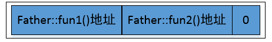

最后一个类似于字符串的结束标志位，VS编译器中为0。

这样的话，虚函数表指针就很容易理解了，这个虚函数表指针指向该虚函数表，也就是虚函数指针的值就是上述指针数组的首地址。

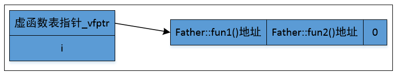

## 四、虚函数地址

函数存放在代码区，虚函数也不例外。虚函数表中存放的是虚函数地址，即代码区虚函数的入口地址。

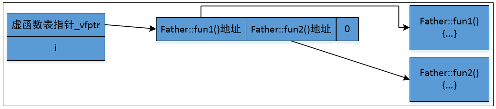

## 五、多态

定义一个Father的子类Son，对虚函数fun1()进行重写。

```cpp
#include<iostream>
using namespace std;
class Father {
public:
	virtual void fun1() { cout << "Father::fun1()" << endl; }
	virtual void fun2() { cout << "Father::fun2()" << endl; }
	int i;
};

class Son :public Father {
	virtual void fun1() { cout << "Son::fun1()" << endl; }

};
int main()
{
	Son son;
	Father father;
	Father *p = &father;
	p->fun1();
	p->fun2();
    p=&son;
    p->fun1();
    p->fun2();
	return 0;
}

```

父类中有虚函数，则子类同样会有一个虚函数指针，这个指针指向一个新表，如下图所示：

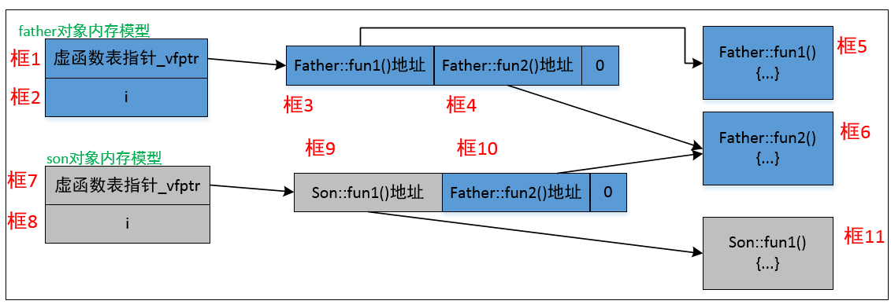

Son类重写了fun1()，未重写fun2()，那么虚函数表中，第一个地址便是重写的Son::fun1()的地址，第二个地址仍然是父类中Father::fun2()的地址。这里可以在vs调试模式下，查看father与son的虚函数表，son表中第二个元素值与father表中第二个元素值相同。

```cpp
	Father *p = &father;
	p->fun1();
	p->fun2();
```

p指向Father对象father：

p->fun1()：沿着`框1->框3->框5`的路径，调用Father::fun1()；

p->fun2()：沿着`框1->框4->框6`的路径，调用Father::fun2()；

```cpp
    p=&son;
    p->fun1();
    p->fun2();
```

p指向子类对象son：

p->fun1()：沿着`框7->框9->框11`的路径，调用Son::fun1()；

p->fun2()：沿着`框7->框10->框6`的路径，调用Father::fun2()；

## 六、通过函数指针操作调用虚函数

现修改main函数

```cpp
typedef void(*Fun)(void);
int main()
{

	Father father;
	Son son;
	printf("虚函数表地址_vfptr:%p\n", *(unsigned int*)(&father));
	printf("第一个虚函数地址e:%p\n", *(unsigned int*)*(unsigned int*)(&father));
	printf("第二个虚函数地址f:%p\n", *((unsigned int*)*(unsigned int*)(&father)+1));

	unsigned char* end = NULL;
	end = (unsigned char*)((unsigned int*)*(unsigned int*)(&father) + 2);
	printf("结束符地址d:%p\n", end);
	printf("结束符值:%d\n", *end);

	Fun pFun = NULL;
	pFun = (Fun)(*((unsigned int*)*(unsigned int*)(&father) + 1));
	pFun();
    
	return 0;
}
```

运行结果：

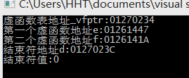

先看一下vs调试模式下各变量的值

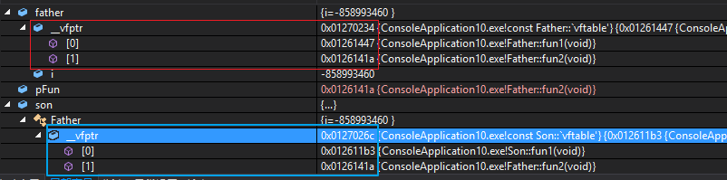

将之前的图修改一下，便于理解：

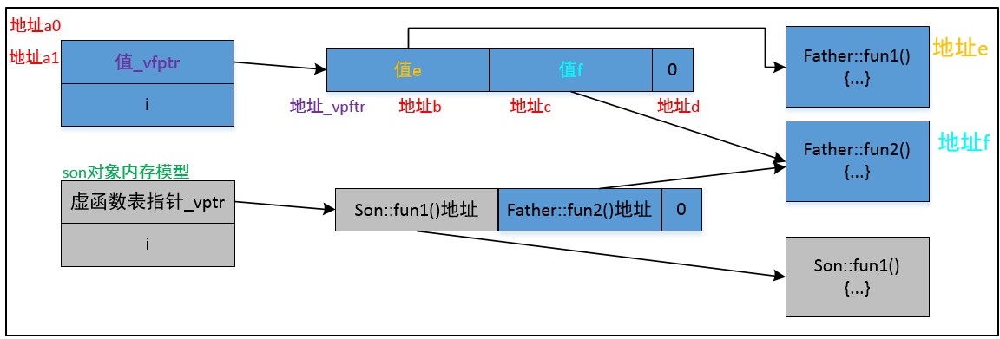

红框中，father中的_vfptr为0x1270234，对应上图中的\_vfptr，即虚函数表的地址；

数组[0]值为0x01261447，对应上图中的e，即Father::fun1()的地址;

数组[1]值为0x0126141a，对应上图中的f，即Father::fun2()的地址。

好了，现在来看一下程序中这些看起来很唬人的东西：

```cpp
	printf("虚函数表地址_vfptr:%p\n", *(unsigned int*)(&father));
	printf("第一个虚函数地址e:%p\n", *(unsigned int*)*(unsigned int*)(&father));
	printf("第二个虚函数地址f:%p\n", *((unsigned int*)*(unsigned int*)(&father)+1));
	unsigned char* end = NULL;
	end = (unsigned char*)((unsigned int*)*(unsigned int*)(&father) + 2);
```

这里，直接用上图中的符号进行分析，否则，说一通xx的地址、对xx解引用等等，容易把人搞晕。

#### `（1）`虚函数表的地址`*(unsigned int*)(&father)`

* a0=&father

* a1=(unsigned int *)a0

* _vfptr=*a1

  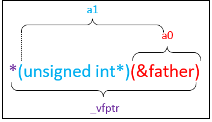

  注意，这里a0和a1的数值是一样的，但只有把地址a0强制转换成(unsigned int *)类型，解引用时系统才会从该地址向后解析4个字节空间，解析成一个unsinged int类型数据。

#### `（2）`第一个虚函数地址\*(unsigned int\*)\*(unsigned int\*)(&father)

* b=(unsigned int*)_vfptr

* e=*b

  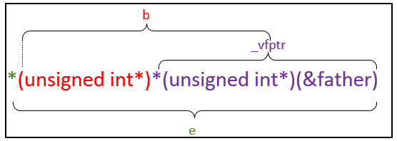

#### `（3）`第二个虚函数地址\*((unsigned int\*)\*(unsigned int\*)(&father)+1)

* c=b+1

* f=*c

  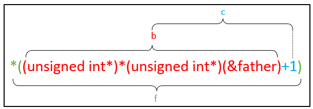

#### `（4）`结束符地址(unsigned char\*)((unsigned int\*)\*(unsigned int\*)(&father) + 2)

* 未强制转换的d=b+2
* 强制转换的d=(unsigned char*)(b+2)

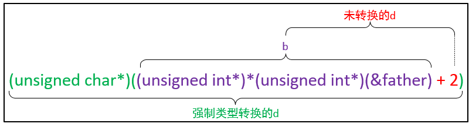

#### `（5）`通过函数指针调用虚函数

```cpp
	Fun pFun = NULL;
	pFun = (Fun)(*((unsigned int*)*(unsigned int*)(&father) + 1));
	pFun();
```

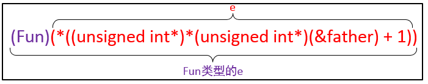

## 七、结语

这篇博文包含许多自己理解的内容，并在此基础上画了图解，如果有误，还请指正。

## 八、参考

[C++ 虚函数表解析](https://blog.csdn.net/haoel/article/details/1948051/)

[虚函数表详解](https://blog.csdn.net/Primeprime/article/details/80776625?ops_request_misc=%257B%2522request%255Fid%2522%253A%2522162054491416780255288869%2522%252C%2522scm%2522%253A%252220140713.130102334..%2522%257D&request_id=162054491416780255288869&biz_id=0&utm_medium=distribute.pc_search_result.none-task-blog-2~all~sobaiduend~default-1-80776625.first_rank_v2_pc_rank_v29&utm_term=%E8%99%9A%E5%87%BD%E6%95%B0%E8%A1%A8%E8%AF%A6%E8%A7%A3)

[C++ 虚函数详解（虚函数表、vfptr）](https://blog.csdn.net/anlian523/article/details/90083205?utm_source=app&app_version=4.7.1&code=app_1562916241&uLinkId=usr1mkqgl919blen)

