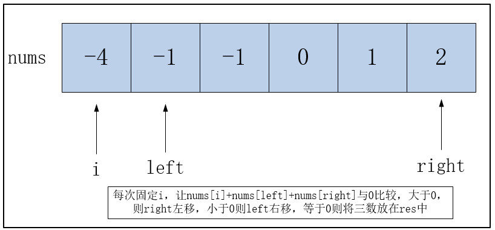

[题目链接](https://leetcode-cn.com/problems/3sum/)

## 1.题目描述


## 2.代码

```cpp
class Solution {
public:
    vector<vector<int>> threeSum(vector<int>& nums) {
        if(nums.size()<3)
            return vector<vector<int>> {};
        sort(nums.begin(),nums.end());
        vector<vector<int>> res;
        for(int i=0;i<nums.size()-2;i++)
        {
            if(nums[i]>0)//如果nums[i]大于0，后面再取任意两数相加都不可能为0，直接返回结果
                return res;
            if(i!=0)//去重操作，比如-4,-3,-3,-2...，nums[i]取到第一个-3，下一次便不能再取下一个-3。
            {
                while(i<nums.size()-2&&nums[i]==nums[i-1])
                    i++;
                if(i==nums.size()-2)
                    return res;
            }
            int left=i+1,right=nums.size()-1;
            while(left<right)
            {
                int sum=nums[i]+nums[left]+nums[right];
                if(sum==0)
                {
                    res.push_back({nums[i],nums[left],nums[right]});
                    left++;
                    while(left<right&&nums[left]==nums[left-1])//去重
                        left++;
                    right--;
                    while(left<right&&nums[right]==nums[right+1])
                        right--;
                }
                else if(sum<0)
                    left++;
                else 
                    right--;
            }
        }
        return res;
    }
};
```


## 3.解题思路

解题思路来自：https://leetcode-cn.com/problems/3sum/solution/pai-xu-shuang-zhi-zhen-zhu-xing-jie-shi-python3-by/



代码去重部分看着有点乱，可先去掉，理解下面的代码之后，再考虑去重

```cpp
class Solution {
public:
    vector<vector<int>> threeSum(vector<int>& nums) {
        if(nums.size()<3)
            return vector<vector<int>> {};
        sort(nums.begin(),nums.end());
        vector<vector<int>> res;
        for(int i=0;i<nums.size()-2;i++)
        {
            if(nums[i]>0)//如果nums[i]大于0，后面再取任意两数相加都不可能为0，直接返回结果
                return res;
            int left=i+1,right=nums.size()-1;
            while(left<right)
            {
                int sum=nums[i]+nums[left]+nums[right];
                if(sum==0)
                {
                    res.push_back({nums[i],nums[left],nums[right]});
                    left++;
                    right--;
                }
                else if(sum<0)
                    left++;
                else 
                    right--;
            }
        }
        return res;
    }
};
```


