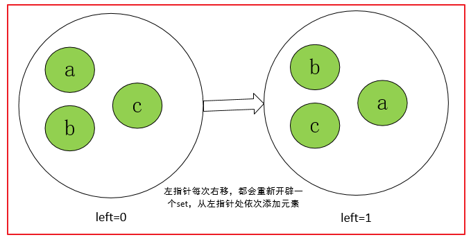

[题目链接]()

## 1.题目描述


## 2.代码

```cpp
class Solution {
public:
    int lengthOfLongestSubstring(string s) {
        if(s.size()==0)
            return 0;
        int left=0;
        int res=1;
        for(;left<s.size()-1;left++)
        {
            unordered_set<char> se;
            se.insert(s[left]);
            for(int right=left+1;right<s.size();right++)
            {
                if(se.find(s[right])==se.end())
                {
                    se.insert(s[right]);
                }
                else 
                    break;
            }
            int size=se.size();
            res=max(res,size);
        }
        return res;
    }
};

```



优化解法

参考：https://leetcode-cn.com/problems/longest-substring-without-repeating-characters/solution/wu-zhong-fu-zi-fu-de-zui-chang-zi-chuan-by-leetc-2/

```cpp
class Solution {
public:
    int lengthOfLongestSubstring(string s) {
        if(s.size()==0)
            return 0;
        unordered_set<int> se;
        int right=0;
        int res=0;
        for(int i=0;i<s.size();i++)
        {
            if(i!=0)
                se.erase(s[i-1]);//移除之前的元素
            for(;right<s.size();right++)
            {
                if(se.count(s[right])==0)
                    se.insert(s[right]);
                else
                    break;
            }
            int size=se.size();
            res=max(res,size);
        }
        return res;

    }
};
```


动态规划

``` cpp
class Solution {
public:
    int lengthOfLongestSubstring(string s) {
        if(s.size()==0)
            return 0;
        unordered_map<char,int> hashmap;
        for(auto it:s)//初始化哈希表为-1
            hashmap[it]=-1;
        vector<int> dp(s.size());
        dp[0]=1;
        hashmap[s[0]]=0;//遍历一次，每遍历一个字符，更新哈希表，表示字符的最新位置
        for(int i=1;i<s.size();i++)
        {
            int d=i-hashmap[s[i]];
            if(d<=dp[i-1])
                dp[i]=d;
            else
               dp[i]=dp[i-1]+1;

            hashmap[s[i]]=i;//更新哈希表
        }
        return *max_element(dp.begin(),dp.end());

    }
};
```


## 3.解题思路

