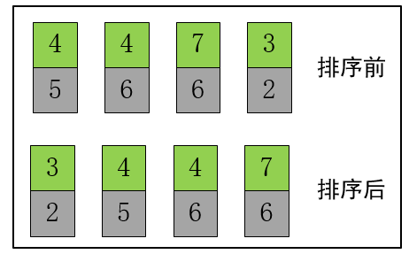

[题目链接](https://leetcode-cn.com/problems/russian-doll-envelopes/)

## 1.题目描述


## 2.代码

```cpp
class Solution {
public:
    static bool cmp(vector<int> a,vector<int>b)
    {
        return a[0]<b[0];
    }
    int maxEnvelopes(vector<vector<int>>& envelopes) {
        int n=envelopes.size();
        sort(envelopes.begin(),envelopes.end(),cmp);
        vector<int> dp(n,1);
        for(int i=1;i<n;i++)
        {
            int temp=0;
            for(int j=0;j<i;j++)
            {
                if(envelopes[j][1]<envelopes[i][1]&&envelopes[j][0]!=envelopes[i][0])
                    temp=max(temp,dp[j]);
            }
            dp[i]+=temp;
        }
        return *max_element(dp.begin(),dp.end());

    }
};
```


## 3.解题思路

先固定长或宽的顺序，比如固定宽，按照宽度从小到大的顺序排列，如下：



这样，就只看长度中最长递增子序列的长度问题了，即[300. 最长递增子序列](https://leetcode-cn.com/problems/longest-increasing-subsequence/)

需要注意的是，判断是否递增时，还需要考虑 宽度是否相等，即`envelopes[j][0]!=envelopes[i][0]`

比如（2,3）、（6,4）、（6,7）这组是不符合要求的，虽然长度3,4,7符合递增要求，但4和7对应的宽度都是6，不符合题意。

