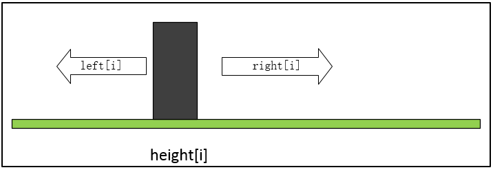
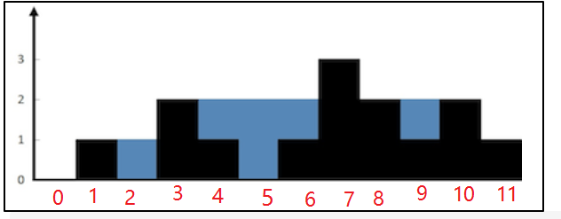

[题目链接]()

## 1.题目描述


## 2.代码

超时代码

```cpp
class Solution {
public:
    int trap(vector<int>& height) {
        int n=height.size();
        if(n==0)
            return 0;
        vector<int> vec;
        int max=*max_element(height.begin(),height.end());
        int res=0;
        for(int i=1;i<=max;i++)
        {
            for(int j=0;j<n;j++)
            {
                if(height[j]>=i)
                    vec.push_back(j);
            }
            if(vec.size()<=1)
                break;
            for(int i=1;i<vec.size();i++)
                res+=vec[i]-vec[i-1]-1;
            vec.clear();
        }
        return res;

    }
};
```


看了[该篇](https://leetcode-cn.com/problems/trapping-rain-water/solution/xiang-xi-tong-su-de-si-lu-fen-xi-duo-jie-fa-by-w-8/)解法二后，参考[CSDN解法](https://blog.csdn.net/stone_fall/article/details/112403223?ops_request_misc=%257B%2522request%255Fid%2522%253A%2522162536527416780274188874%2522%252C%2522scm%2522%253A%252220140713.130102334.pc%255Fall.%2522%257D&request_id=162536527416780274188874&biz_id=0&utm_medium=distribute.pc_search_result.none-task-blog-2~all~first_rank_v2~rank_v29-1-112403223.first_rank_v2_pc_rank_v29&utm_term=%E7%89%9B%E5%AE%A2%E7%BD%91%7C%E9%AB%98%E9%A2%91%E9%9D%A2%E8%AF%95%E9%A2%98%7C%E5%AE%B9%E5%99%A8%E7%9B%9B%E6%B0%B4%E9%97%AE%E9%A2%98&spm=1018.2226.3001.4187)写的

```cpp
class Solution {
public:
    int trap(vector<int>& height) {
        int n=height.size();
        if(n==0)
            return 0;
        vector<int> left(n),right(n);
        left[0]=height[0];
        right[n-1]=height[n-1];
        for(int i=1;i<n;i++)
        {
            left[i]=max(left[i-1],height[i-1]);
        }
        for(int j=n-2;j>=0;j--)
        {
            right[j]=max(right[j+1],height[j+1]);
        }
        
        int res=0;
        for(int i=1;i<n-1;i++)
        {
            int temp=max(min(left[i],right[i])-height[i],0);
            res+=temp;
        }
        return res;

    }
};
```


## 3.解题思路

解法二中，

left[i]：i下标对应的柱子，左边最高的柱子高度

right[i]：i下标对应的柱子，右边最高的柱子高度



比如，

i=1时，left[1]=0,right[1]=3，此时柱子上接水量为max( min(3,0)-1 , 0 )=0；

i=2时,left[2]=1,right=3，此时柱子上接水量为max( min(3,1)-0 , 0 )=1；

i=3时，left[3]=1,right=3，此时柱子上接水量为max( min(3,1)-2 , 0 )=0；

i=4时，left[4]=2,right=3，此时柱子上接水量为max( min(3,2)-1 , 0 )=1；

...

最后就是将上述结果都加起来。



其中，求解left[i]和right[i]的过程用到了动态规划。

求解left[i]和right[i]的两个for循环也可以合成一个：

```cpp
for(int i=1;i<n;i++)
{
    left[i]=max(left[i-1],height[i-1]);
    right[n-i-1]=max(right[n-i],height[n-i]);
}
```

