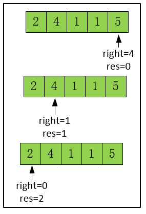

[题目链接]()

## 1.题目描述


## 2.代码

```cpp
class Solution {
public:
    int jump(vector<int>& nums) {
        int right=nums.size()-1;
        int left=right-1;
        int res=0;
        while(right>0)
        {
            int flag=right;
            for(int i=right,left=right-1;left>=0;left--)
            {
                if(left+nums[left]>=right)
                    flag=left;
            }
            res++;
            right=flag;
        }
        return res;
    }
};
```


从前往后找

```cpp
class Solution {
public:
    int jump(vector<int>& nums) {
        int size=nums.size();
        int right=size-1;
        int res=0;
        while(right>0)
        {
            for(int i=0;i<right;i++)
            {
                if(i+nums[i]>=right)
                {
                    right=i;
                    res++;
                    break;
                }
            }
        }
        return res;
    }
};
```



## 3.解题思路

