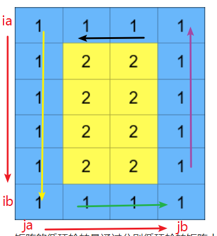

[题目链接]()

## 1.题目描述


## 2.代码

```cpp
class Solution {
public:
    vector<vector<int>> rotateGrid(vector<vector<int>>& grid, int k) {
        int row=grid.size();
        int col=grid[0].size();
        int ia=0,ib=row-1,ja=0,jb=col-1;
        while((ib>ia) &&(jb>ja))
        {
            fun(ia,ib,ja,jb,k,grid);
            ia++;
            ib--;
            ja++;
            jb--;
        }
        return grid;

    }
    void fun(int &ia, int &ib, int &ja, int &jb, int &k, vector<vector<int>> &grid)
    {
        deque<int> que;
        for (int i = ia; i <= ib; i++)//左列
            que.push_back(grid[i][ja]);
        for (int j = ja + 1; j <= jb; j++)//下行
            que.push_back(grid[ib][j]);
        for (int i = ib - 1; i >= ia; i--)//右列
            que.push_back(grid[i][jb]);
        for (int j = jb - 1; j>ja; j--)//上行
            que.push_back(grid[ia][j]);
        for (int i = 0; i<k%que.size(); i++)
        {
            que.push_front(que.back());
            que.pop_back();
        }

        for (int i = ia; i <= ib; i++)//左列
        {
            grid[i][ja] = que.front();
            que.pop_front();
        }
        for (int j = ja + 1; j <= jb; j++)//下行
        {
            grid[ib][j] = que.front();
            que.pop_front();
        }
        for (int i = ib - 1; i >= ia; i--)//右列
        {
            grid[i][jb] = que.front();
            que.pop_front();
        }

        for (int j = jb - 1; j>ja; j--)//上行
        {
            grid[ia][j] = que.front();
            que.pop_front();
        }
    }
};
```


## 3.解题思路

从外往里，一层层进行模拟。

函数fun的功能是，传入矩阵，传入需要循环轮转的四个点，以及轮转的次数，实现该层轮转。




首先，第一轮，fun中，

* 定义一个双端队列que，依次遍历黄线、绿线、紫线、黑线，将元素放入队列中。
* 用该队列模拟轮转，需要注意的是，需对k取余，减少不要循环。
* 将队列中元素依次放入原位置。