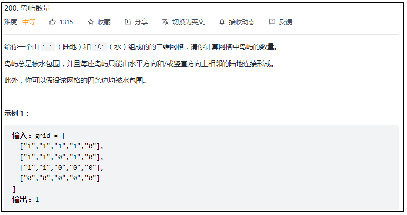
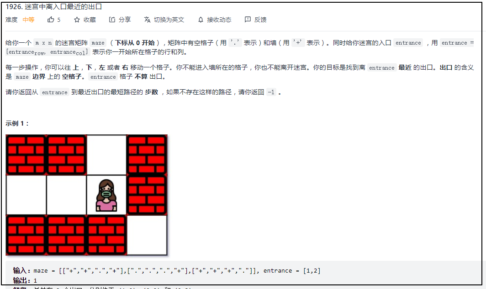

#### [200. 岛屿数量](https://leetcode-cn.com/problems/number-of-islands/)



#### 深度优先

```cpp
class Solution {
public:
    int numIslands(vector<vector<char>>& grid) {
        int row=grid.size();
        int col=grid[0].size();
        int res=0;
        for(int i=0;i<row;i++)
        {
            for(int j=0;j<col;j++)
            {
                if(grid[i][j]=='1')
                {
                    dfs(grid,i,j);
                    res++;
                }     
            }
        }
        return res;
    }
    //深度优先，将遇到的1变为0
    void dfs(vector<vector<char>> &grid,int i,int j)
    {
        int row=grid.size();
        int col=grid[0].size();
        if(i<0||i>=row||j<0||j>=col||grid[i][j]=='0')
            return ;
        grid[i][j]='0';
        dfs(grid,i-1,j);//上
        dfs(grid,i+1,j);//下
        dfs(grid,i,j-1);//左
        dfs(grid,i,j+1);//右
    }
};
```

#### 广度优先

```cpp
class Solution {
public:
    int rows;
    int cols;
    int numIslands(vector<vector<char>>& grid) {

        rows=grid.size();//初始化数据
        cols=grid[0].size();

        int res=0;
        for(int i=0;i<rows;i++)
        {
            for(int j=0;j<cols;j++)
            {
                if(grid[i][j]=='1')//对符合要求的点进行BFS
                {
                    bfs(grid,i,j);
                    res++;
                }
            }
        }
        return res;
    }

    void bfs(vector<vector<char>> &grid,int &i,int &j)
    {
        queue<pair<int,int>> que;//定义队列

        que.push({i,j});//将初始点（i,j）加入队列中
        grid[i][j]='0';//加入队列中的元素都符合要求，加入后，需修改状态

        int dirs[4][2]={{-1,0},{0,1},{1,0},{0,-1}};//方向数组，上、下、左、右

        while(!que.empty())
        {
            int first=que.front().first;//取出首节点数据并弹出
            int second=que.front().second;
            que.pop();

            for(int m=0;m<4;m++)//遍历四个方向
            {
                int x=first+dirs[m][0];
                int y=second+dirs[m][1];
                if(x>=0&&x<rows&&y>=0&&y<cols&&grid[x][y]=='1')
                {
                    que.push({x,y});
                    grid[x][y]='0';//加入队列中的元素都符合要求，加入后，需修改状态
                }
            }
        }
     }

};
```

#### [1926. 迷宫中离入口最近的出口](https://leetcode-cn.com/problems/nearest-exit-from-entrance-in-maze/)



广度优先遍历

```cpp
class Solution {
public:
    int nearestExit(vector<vector<char>>& maze, vector<int>& entrance) {
        const int rows = maze.size();//行和列大小
        const int cols = maze[0].size();

        int res = 0;//记录结果

        queue<pair<int, int>> que;//队列，将起始点加入
        que.push({entrance[0], entrance[1]});
        maze[entrance[0]][entrance[1]]='+';

        int dirPos[4][2] = { { -1,0 },{ 1,0 },{ 0,-1 },{ 0,1 } };//方向数组，上、下、左、右

        while (!que.empty())
        {
            int size = que.size();//BFS每层元素的数量
            for (int i = 0; i<size; i++)
            {
                int row = que.front().first;
                int col = que.front().second;
                que.pop();
                //在边界上，并且不是在初始位置，则找到最近出口，直接返回结果
                if ((row == 0 || row == rows - 1 || col == 0 || col == cols - 1) && (row!= entrance[0]||col!= entrance[1]))
                    return res;

                for (int j = 0; j<4; j++)//将四个方向位置加入队列中
                {
                    int next_row = row + dirPos[j][0];
                    int next_col = col + dirPos[j][1];
                    //没出边界，并且位置处不为“墙”
                    if ((next_row >= 0 && next_row<rows&&next_col >= 0 && next_col<cols) && maze[next_row][next_col] == '.')
                    {
                        que.push({ next_row,next_col });
                        maze[next_row][next_col] = '+';//将加入队列中的位置处设为“墙”，防止重复加入
                    }
                }
            }
            res++;//每进行完一层，便将结果加1
        }
        return -1;
    }
};
```

