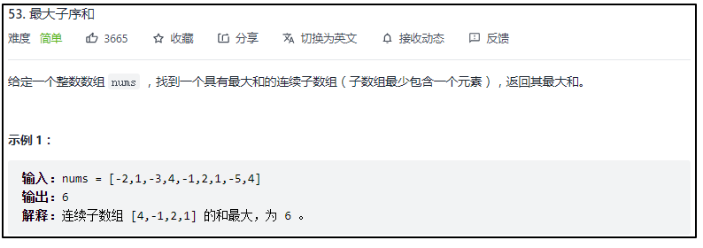
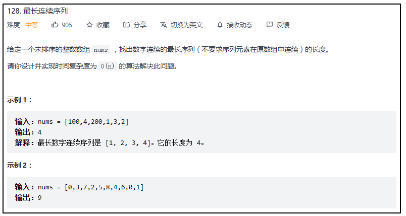
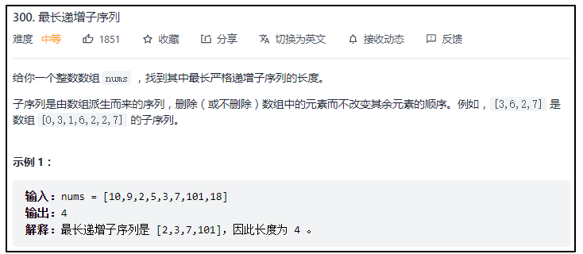
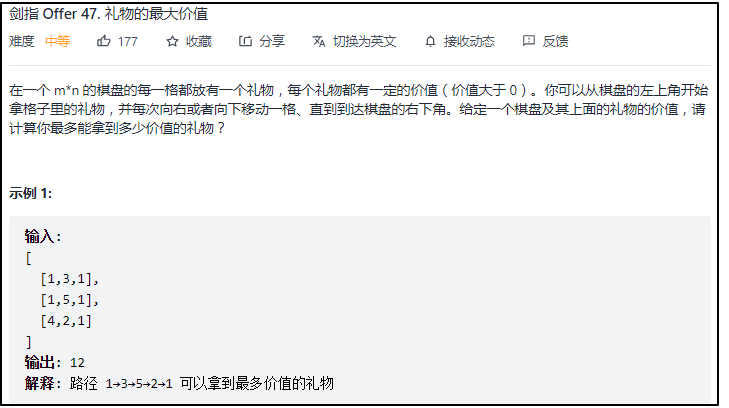
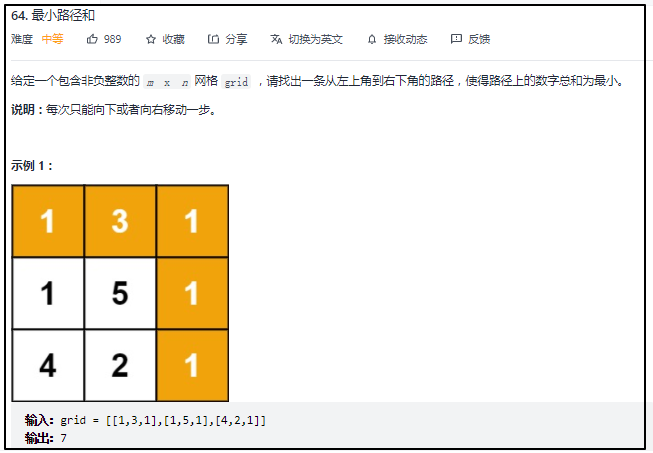
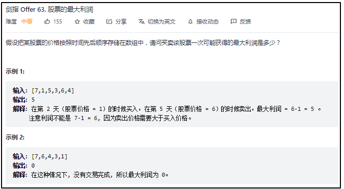
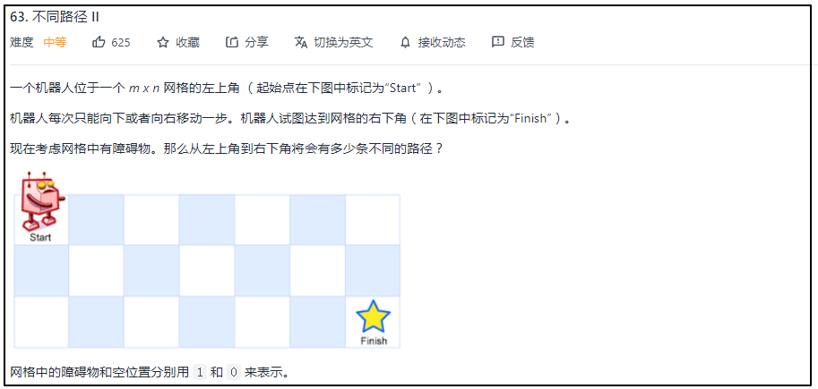

动态规划

#### [53. 最大子序和](https://leetcode-cn.com/problems/maximum-subarray/)



```cpp
class Solution {
public:
    int maxSubArray(vector<int>& nums) {
        vector<int> dp(nums.size());
        dp[0]=nums[0];
        int sum=nums[0];
        for(int i=1;i<nums.size();i++)
        {
            sum+=nums[i];
            if(sum<=0)
            {
                dp[i]=nums[i];
            }
        }
    }
};
```

#### [128. 最长连续序列](https://leetcode-cn.com/problems/longest-consecutive-sequence/)



```cpp
class Solution {
public:
    int longestConsecutive(vector<int>& nums) {
        if(nums.size()==0)
            return 0;
        sort(nums.begin(),nums.end());
        auto it = unique(nums.begin(),nums.end());
        nums.erase(it,nums.end());

        vector<int> dp(nums.size(),1);
        for(int i=1;i<nums.size();i++)
        {
            if(nums[i]-nums[i-1]==1)
                dp[i]=dp[i-1]+1;
        }
        return *max_element(dp.begin(),dp.end());

    }
};
```

#### [300. 最长递增子序列](https://leetcode-cn.com/problems/longest-increasing-subsequence/)



```cpp
class Solution {
public:
    int lengthOfLIS(vector<int>& nums) {
        vector<int> dp(nums.size(),1);
        for(int i=0;i<nums.size();i++)
        {
            for(int j=0;j<i;j++)
            {
                if(nums[i]>nums[j])
                {
                    dp[i]=max(dp[i],dp[j]+1);
                }
            }
        }
        return *max_element(dp.begin(),dp.end());
    }
};
```

#### [剑指 Offer 47. 礼物的最大价值](https://leetcode-cn.com/problems/li-wu-de-zui-da-jie-zhi-lcof/)



```cpp
class Solution {
public:
    int maxValue(vector<vector<int>>& grid) {
        int row=grid.size();
        int col=grid[0].size();
        for(int i=0;i<row;i++)
        {
            for(int j=0;j<col;j++)
            {
                int left=0;
                int up=0;
                if(j>0)
                   left=grid[i][j-1];
                if(i>0)
                    up=grid[i-1][j];
                grid[i][j]+=max(left,up);
            }
        }
        return grid[row-1][col-1];
    }
};
```

#### [64. 最小路径和](https://leetcode-cn.com/problems/minimum-path-sum/)



```cpp
class Solution {
public:
    int minPathSum(vector<vector<int>>& grid) {
        vector<vector<int>> dp=grid;
        
        for(int j=1;j<dp[0].size();j++)//求第一行
            dp[0][j]+=dp[0][j-1];

        for(int i=1;i<dp.size();i++)//求第一列
            dp[i][0]+=dp[i-1][0];
        
        for(int i=1;i<dp.size();i++)//从（1,1）的位置开始求
        {
            for(int j=1;j<dp[0].size();j++)
            {
                dp[i][j]+=min(dp[i-1][j],dp[i][j-1]);
            }
        }
        return dp[dp.size()-1][dp[0].size()-1];
    }
};
```

#### [剑指 Offer 63. 股票的最大利润](https://leetcode-cn.com/problems/gu-piao-de-zui-da-li-run-lcof/)



```cpp
class Solution {
public:
    int maxProfit(vector<int>& prices) {
        if(prices.size()==0)
            return 0;
        vector<int> dp(prices.size(),0);
        int minValue=prices[0];
        for(int i=1;i<prices.size();i++)
        {
            minValue=min(minValue,prices[i]);//最小值
            dp[i]=max(dp[i-1],prices[i]-minValue);
        }
        return dp[prices.size()-1];
    }
};
```

```cpp
class Solution {
public:
    int maxProfit(vector<int>& prices) {
        if(prices.size()==0)
            return 0;
        int min_value=INT_MAX;
        vector<int> dp(prices.size());
        for(int i=0;i<prices.size();i++)
        {
            min_value=min(min_value,prices[i]);//取得当前为止，买入股票的最小值
            dp[i]=prices[i]-min_value;//当前股票值-买入股票最小值=之前选的最小买入值，在当前点卖
        }                             //获得的利润
        return *max_element(dp.begin(),dp.end());
    }
};
```

#### [63. 不同路径 II](https://leetcode-cn.com/problems/unique-paths-ii/)



二维dp

```cpp
class Solution {
public:
    int uniquePathsWithObstacles(vector<vector<int>>& obstacleGrid) {
        const int rows=obstacleGrid.size(),cols=obstacleGrid[0].size();
        if(obstacleGrid[0][0]==1||obstacleGrid[rows-1][cols-1]==1)
            return 0;

        vector<vector<int>> dp(rows,vector<int>(cols,0));//定义dp数组

        for(int j=0;j<cols&&obstacleGrid[0][j]==0;j++)//初始化第1行
            dp[0][j]=1;

        for(int i=0;i<rows&&obstacleGrid[i][0]==0;i++)//初始化第1列
            dp[i][0]=1;

        for(int i=1;i<rows;i++)//从（1,1）位置开始
        {
            for(int j=1;j<cols;j++)
            {
                dp[i][j]=(obstacleGrid[i][j]==1)?0:dp[i-1][j]+dp[i][j-1];
            }
        }
        return dp[rows-1][cols-1];
    }
};
```

一维dp

```cpp
class Solution {
public:
    int uniquePathsWithObstacles(vector<vector<int>>& obstacleGrid) {
        const int rows=obstacleGrid.size(),cols=obstacleGrid[0].size();
        if(obstacleGrid[0][0]==1||obstacleGrid[rows-1][cols-1]==1)
            return 0;

        vector<int> dp(cols,0);
        for(int j=0;j<cols&&obstacleGrid[0][j]==0;j++)//先用第一行初始化dp
            dp[j]=1;

        for(int i=1;i<rows;i++)
        {
            if(obstacleGrid[i][0]==1)//如果第1列某行有1，那么从此之后，dp[0]都为0
                dp[0]=0;

            for(int j=1;j<cols;j++)
            {
                dp[j]=(obstacleGrid[i][j]==1)?0:dp[j]+dp[j-1];
            }
        }
        return dp[cols-1];
    }
};
```

