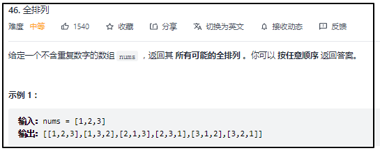
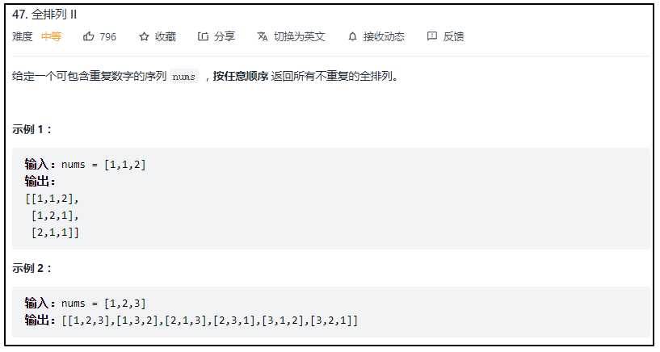
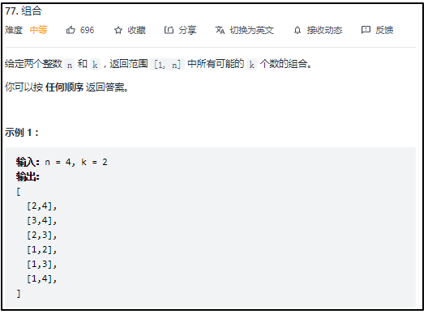
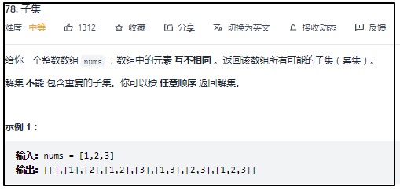
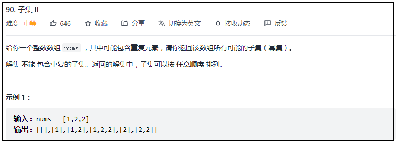
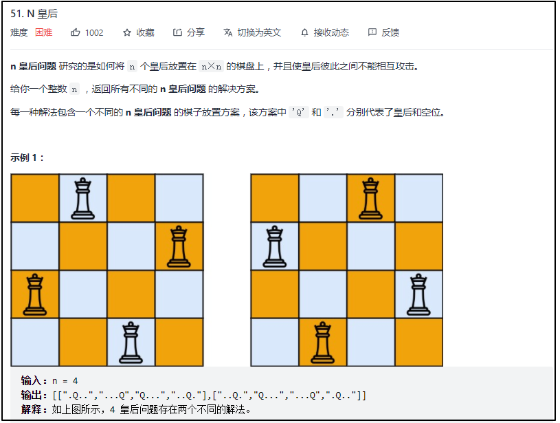
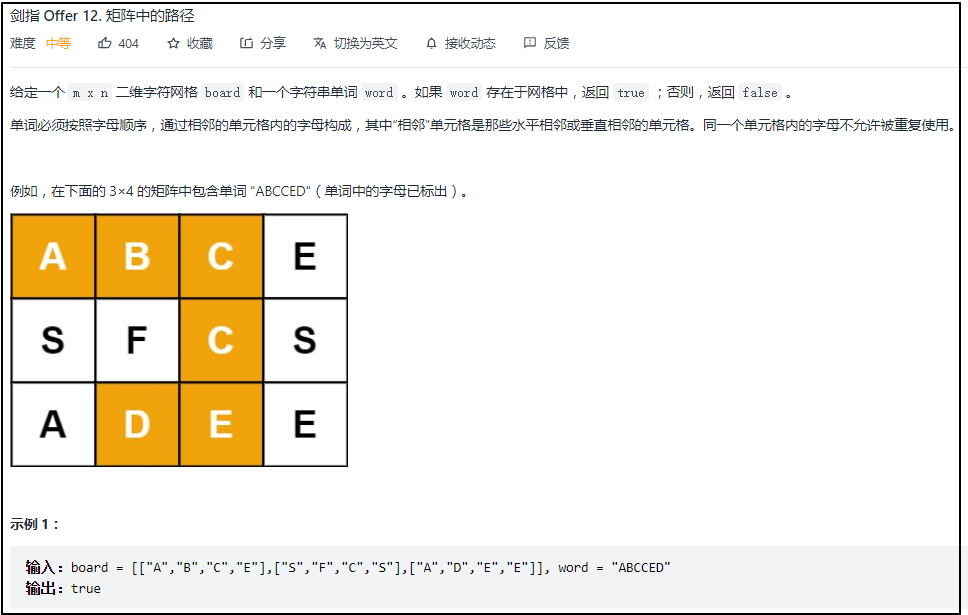

#### [46. 全排列](https://leetcode-cn.com/problems/permutations/)



```cpp
class Solution {
public:
    vector<vector<int>> res;
    vector<int> path;
    vector<bool> visited;
    vector<vector<int>> permute(vector<int>& nums) {
        visited.resize(nums.size(),false);
        backtracking(nums);
        return res;
    }
    void backtracking(vector<int> &nums)
    {
        if(path.size()==nums.size())
        {
            res.push_back(path);
            return ;
        }
        for(int i=0;i<nums.size();i++)
        {
            if(visited[i]==false)
            {
                //处理节点
                visited[i]=true;
                path.push_back(nums[i]);

                //递归
                backtracking(nums);

                //回溯，撤销节点处理
                visited[i]=false;
                path.pop_back();
            }
        }
    }
};
```

#### [47. 全排列 II](https://leetcode-cn.com/problems/permutations-ii/)



#### [77. 组合](https://leetcode-cn.com/problems/combinations/)



```cpp
class Solution {
public:
    vector<int> path;
    vector<vector<int>> res;
    vector<vector<int>> combine(int n, int k) {
        backtracking(n,k,1);
        return res;
    }
    void backtracking(const int &n,const int &k,int startIndex)
    {
        if(path.size()==k)
        {
            res.push_back(path);
            return;
        }
        for(int i=startIndex;i<=n;i++)
        {   
            path.push_back(i);//处理节点    
            backtracking(n,k,i+1);//递归
            path.pop_back();//回溯，撤销处理
        }
    }
};
```

#### [78. 子集](https://leetcode-cn.com/problems/subsets/)



```cpp
class Solution {
public:
    vector<int> path;
    vector<vector<int>> res;
    vector<vector<int>> subsets(vector<int>& nums) {
        backtracking(nums,0);
        return res;
    }
    void backtracking(vector<int> &nums,int startIndex)
    {
         res.push_back(path);

         for(int i=startIndex;i<nums.size();i++)
         {
             path.push_back(nums[i]);//处理节点
             backtracking(nums,i+1);//递归
             path.pop_back();//回溯，撤销处理结果
         }
    }
};
```

#### [90. 子集 II](https://leetcode-cn.com/problems/subsets-ii/)



```cpp
class Solution {
public:
    vector<int> path;
    vector<vector<int>> res;
    vector<bool> visited;

    vector<vector<int>> subsetsWithDup(vector<int>& nums) {
        visited.resize(nums.size(),false);
        sort(nums.begin(),nums.end());
        backtracking(nums,0);
        return res;
    }
    void backtracking(vector<int> &nums,int start)
    {
        res.push_back(path);//每进来一次，都是一种新的可能

        for(int i=start;i<nums.size();i++)
        {
            if(visited[i]==false)
            {
                if(i>=1&&nums[i]==nums[i-1]&&visited[i-1]==false)//从1开始，剪枝
                    continue;

                visited[i]=true;//处理节点
                path.push_back(nums[i]);

                backtracking(nums,i+1);//递归

                visited[i]=false;//回溯，取消节点处理
                path.pop_back();
            }
        }
    }
};
```

#### [51. N 皇后](https://leetcode-cn.com/problems/n-queens/)



```cpp
class Solution {
public:
    vector<string> path;
    vector<vector<string>> res;
    vector<bool> visited;
    vector<vector<string>> solveNQueens(int n) {
        visited.resize(n,false);
        path.resize(n,string(n,'.'));
        backtracking(n,0);
        return res;
    }

    bool isvalid(int col,int row,const int &n)
    {
        //判断列
        if(visited[col]==true)
            return false;
        
        //判断45°方向
        for(int i=1;row-i>=0&&col+i<n;i++)
            if(path[row-i][col+i]=='Q')
                return false;
        
        //判断135°方向
        for(int i=1;row-i>=0&&col-i>=0;i++)
            if(path[row-i][col-i]=='Q')
                return false;
        return true;


    }
    void backtracking(const int &n,int row)
    {
        if(n==row)
        {
            res.push_back(path);
            return;
        }
        for(int col=0;col<n;col++)
        {
            if(isvalid(col,row,n))
            {
                //处理节点
                path[row][col]='Q';
                visited[col]=true;

                //递归
                backtracking(n,row+1);

                //回溯，撤销处理
                path[row][col]='.';
                visited[col]=false;

            }
        }
    }
};
```

#### [剑指 Offer 12. 矩阵中的路径](https://leetcode-cn.com/problems/ju-zhen-zhong-de-lu-jing-lcof/)



```cpp
class Solution {
public:
    int rows;
    int cols;
    vector<vector<bool>> visited;
    bool exist(vector<vector<char>>& board, string word) {
        
        //变量初始化
        rows=board.size();
        cols=board[0].size();
        visited.resize(rows,vector<bool>(cols,false));

        for(int row=0;row<rows;row++)
        {
            for(int col=0;col<cols;col++)
            {
                if(hasPathCore(board,word,row,col,0))
                {
                    return true;
                }
            }
        }
        return false;

    }
    bool hasPathCore(const vector<vector<char>> &board,const string &word,int row,int col,int pathLength)
    {
        //终止条件
        if(pathLength==word.size())
            return true;
        if(row<0||row>=rows||col<0||col>=cols||visited[row][col]==true||word[pathLength]!=board[row][col])
            return false;

        visited[row][col]=true;//1.处理节点

                                //2.递归
        bool hasPath=hasPathCore(board,word,row,col-1,pathLength+1)||
                hasPathCore(board,word,row,col+1,pathLength+1)||
                hasPathCore(board,word,row-1,col,pathLength+1)||
                hasPathCore(board,word,row+1,col,pathLength+1);
        
        visited[row][col]=false;//3.回溯，撤销节点处理
        
        return hasPath;//返回结果

    }
};
```

