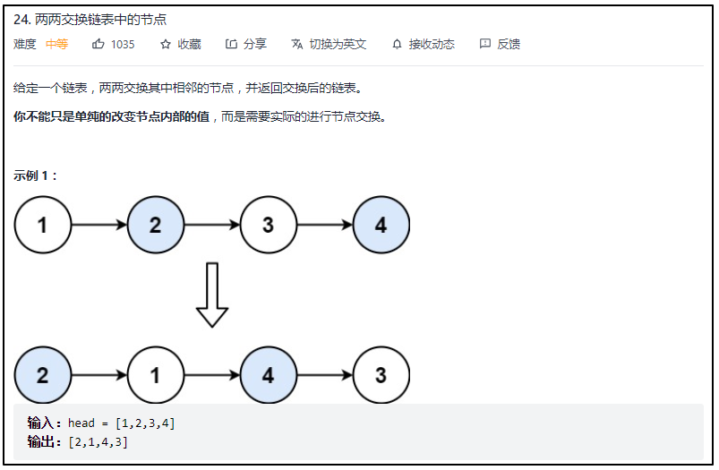
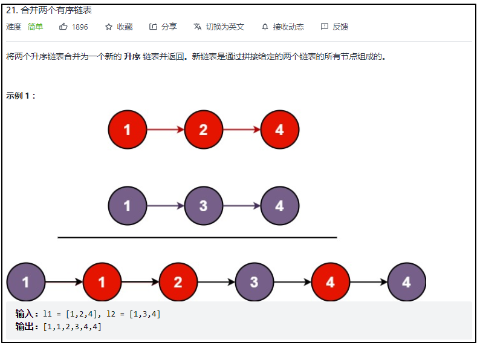
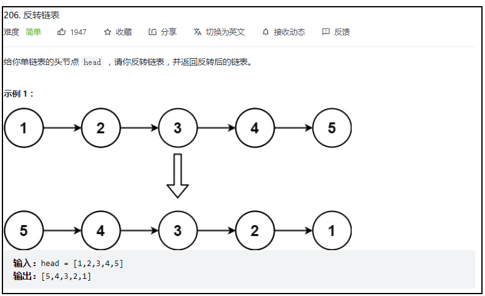

递归

#### [24. 两两交换链表中的节点](https://leetcode-cn.com/problems/swap-nodes-in-pairs/)



```cpp
/**
 * Definition for singly-linked list.
 * struct ListNode {
 *     int val;
 *     ListNode *next;
 *     ListNode() : val(0), next(nullptr) {}
 *     ListNode(int x) : val(x), next(nullptr) {}
 *     ListNode(int x, ListNode *next) : val(x), next(next) {}
 * };
 */
class Solution {
public:
    ListNode* swapPairs(ListNode* head) {
        if(head == NULL || head->next == NULL){
            return head;
        }
        ListNode *next = head->next;
        head->next = swapPairs(next->next);
        next->next = head;
        return next;
    }
};
```

#### [21. 合并两个有序链表](https://leetcode-cn.com/problems/merge-two-sorted-lists/)



```cpp
class Solution {
public:
    ListNode* mergeTwoLists(ListNode* l1, ListNode* l2) {

        if(l1==nullptr)
            return l2;
        if(l2==nullptr)
            return l1;
        if(l1->val < l2->val)
        {
            l1->next=mergeTwoLists(l1->next,l2);
            return l1;
        }
        else
        {
            l2->next=mergeTwoLists(l1,l2->next);
            return l2;
        }

    }
};
```

 [206. 反转链表](https://leetcode-cn.com/problems/reverse-linked-list/)



```cpp

class Solution {
public:
    ListNode* reverseList(ListNode* head) {
        if(head==nullptr)
            return head;
        ListNode *newhead=head;
        while(newhead->next!=nullptr)
            newhead=newhead->next;
        fun(head);
        return newhead;
        

    }
    ListNode *fun(ListNode *head)
    {
        if(head->next==nullptr)
            return head;
        ListNode *next=fun(head->next);
        next->next=head;
        head->next=nullptr;
        return head;
    }
};
```

