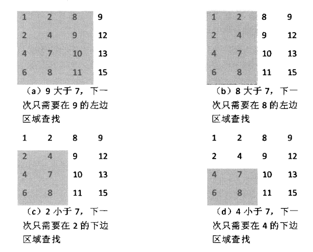

## 题目描述

[题目链接](https://www.nowcoder.com/practice/abc3fe2ce8e146608e868a70efebf62e?tpId=13&rp=1&ru=%2Fta%2Fcoding-interviews&qru=%2Fta%2Fcoding-interviews%2Fquestion-ranking&tab=answerKey)

在一个二维数组中（每个一维数组的长度相同），每一行都按照从左到右递增的顺序排序，每一列都按照从上到下递增的顺序排序。请完成一个函数，输入这样的一个二维数组和一个整数，判断数组中是否含有该整数。

示例1

输入

>  7,[[1,2,8,9],[2,4,9,12],[4,7,10,13],[6,8,11,15]]

返回值

> true

## 代码

```cpp
class Solution {
public:
    bool Find(int target, vector<vector<int> > array) {
        int xMaxSize=array.size(),yMaxSize=array[0].size();
        int x=0,y=yMaxSize-1;
        while(x!=xMaxSize&&y!=-1)
        {
            if(array[x][y]>target)
                y--;
            else if(array[x][y]<target)
                x++;
            else
                return true;
        }
        return false;
    }
};
```

## 解题思路

根据《剑指offer》中的思路：

 （1）`假设x、y为矩阵右上角元素的索引，选取该元素a与target进行比较`：

* 如果a大于target，则其所在列均大于target，舍弃该列，即y--；
* 如果a小于target，则其所在行均小于target，舍弃改行，即x++；
* 否则，a等于target，返回true。

（2）`算法结束条件`

* 遍历过程中，找到目标元素，返回true；
* 当x超出最大行或者y低于最小列时，整个矩阵遍历结束，没有找到目标元素，返回false。





## 注

也可选取左下角元素，右上角和左上角元素的共同特点是：在行或列中，为最大或最小。

