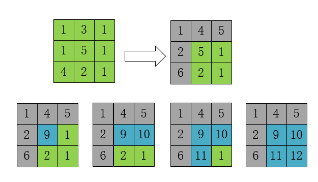

[题目链接]()

## 1.题目描述


## 2.代码

```cpp
class Solution {
public:
    int maxValue(vector<vector<int>>& grid) {
        if(grid.size()==0||grid[0].size()==0)//特例
            return 0;
        int width=grid[0].size();
        int height=grid.size();
        for(int i=1;i<height;i++)
            grid[i][0]+=grid[i-1][0];
        for(int j=1;j<width;j++)
            grid[0][j]+=grid[0][j-1];
        for(int i=1;i<height;i++)
        {
            for(int j=1;j<width;j++)
                grid[i][j]+=max(grid[i][j-1],grid[i-1][j]);
        }
        return grid[height-1][width-1];

    }
};
```


## 3.解题思路

首先，将第一行和第一列计算出来

然后，从【1,1】开始，使用两个for循环，依次计算。

