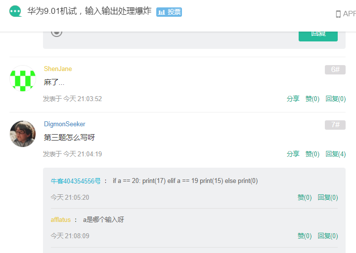
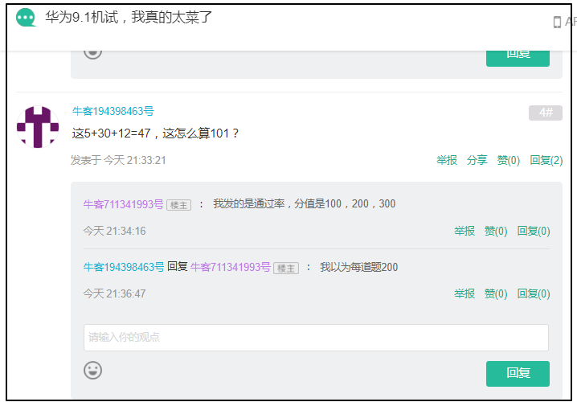

## 1.万能头文件

```cpp
#include <bits/stdc++.h>
```

但不建议用。

## 2.输入多组字符串

```cpp
string str;
while(cin>>str)
{
    ...
}
```

注意这种只能输入不含空格的字符串。

如果字符串含有空格，需使用：

```cpp
while(getline(cin,str));
```

### 3.输入数组，实际输入可能是字符串，需要手动提取出数组


## 3.偷分技巧

### 3.1

[链接](https://www.nowcoder.com/discuss/727860?type=post&order=time&pos=&page=2&ncTraceId=&channel=-1&source_id=search_post_nctrack)



### 3.2

链接：https://www.nowcoder.com/discuss/727914?type=post&order=time&pos=&page=1&ncTraceId=&channel=-1&source_id=search_post_nctrack




##### 需要用getchar()吃掉回车的几种情况个人实验总结:https://blog.csdn.net/u011562187/article/details/9955785

最重要的一个，输入数字后，想要输入字符串，需要使用getchar()来吃回车

```cpp
int main()
{

	string str;
	int a;
	cin >> a;
	getchar();
	getline(cin, str);
	cout << str << endl;
	return 0;
}
```

### 3.3


