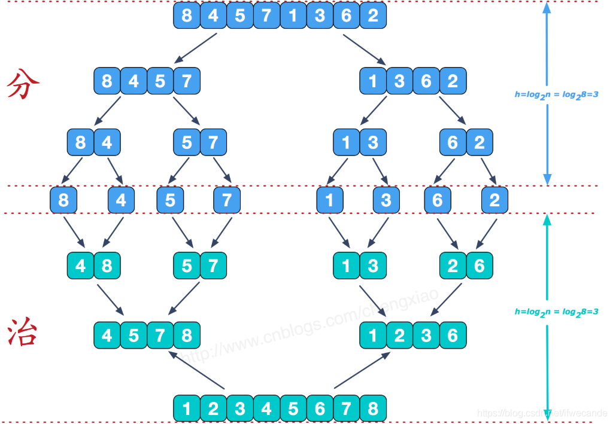

文章

[归并排序的思想与实现（递归与迭代）](https://blog.csdn.net/ifwecande/article/details/108579279)

图解



代码

```cpp
#include<iostream>
#include<vector>
using namespace std;
void merge(vector<int> &vec, int, int, int);
void merge_sort(vector<int> &vec, int, int);

int main()
{
	vector<int> vec = { 4, 2, 9, 13, 5, 7, 3, 8 };

	int right = vec.size() - 1;
	int left = 0;
	merge_sort(vec, left, right);
	for (auto it : vec)
		cout << it << " ";

	return 0;

}


void merge_sort(vector<int> &vec, int left, int right)
{
	if (left < right)
	{
		int mid = (left + right) / 2;

		merge_sort(vec, left, mid);//分：将问题分成一些小问题
		merge_sort(vec, mid + 1, right);
        
		merge(vec, left, mid, right);//治：递归求解
	}
}
void merge(vector<int> &vec, int left, int mid, int right)
{


	int halfSize = right - mid;
	vector<int> vecL(halfSize, 0);//另一种方法是，将该行及下一行注释，后面注释都解除
	vector<int> vecR(halfSize, 0);


	//vector<int> vecL(halfSize+1, 0);
	//vector<int> vecR(halfSize+, 0);
    //vecL[halfSize] = INT_MAX;
	//vecR[halfSize] = INT_MAX;

    //需要两数组来暂存两有序子数列归并的结果，故辅助空间复杂度为O（n）
	for (int i = 0; i < halfSize; i++)
	{
		vecL[i] = vec[left + i];
	}
	for (int j = 0; j < halfSize; j++)
	{
		vecR[j] = vec[mid + j + 1];
	}

	for (int i = 0, j = 0, k = left; k <= right; k++)
	{
		int numL = i < halfSize ? vecL[i] : INT_MAX;
		int numR = j < halfSize ? vecR[j] : INT_MAX;
		if (numL < numR)
		{
			vec[k] = numL;
			i++;
		}
		else
		{
			vec[k] = numR;
			j++;
		}
	}
	//for (int i = 0, j = 0, k = left; k <= right; k++)
	//{
	//	if (vecL[i] <= vecR[j])
	//	{
	//		vec[k] = vecL[i];
	//		i++;
	//	}
	//	else
	//	{
	//		vec[k] = vecR[j];
	//		j++;
	//	}
	//}


}


```

