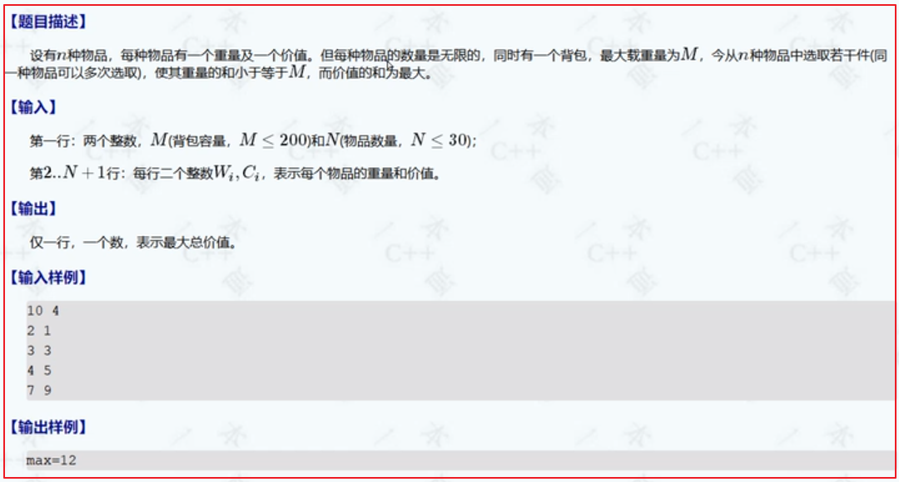
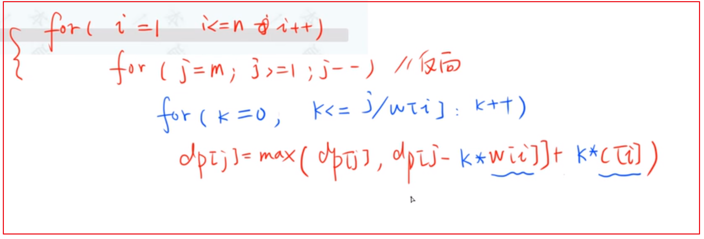
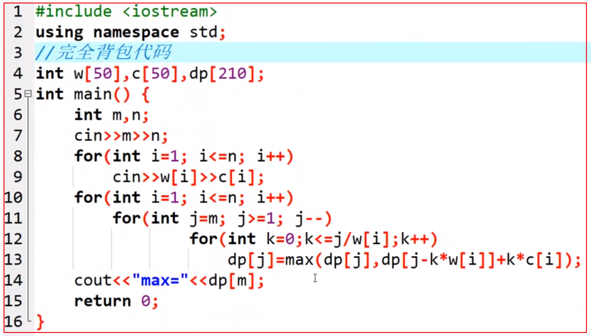
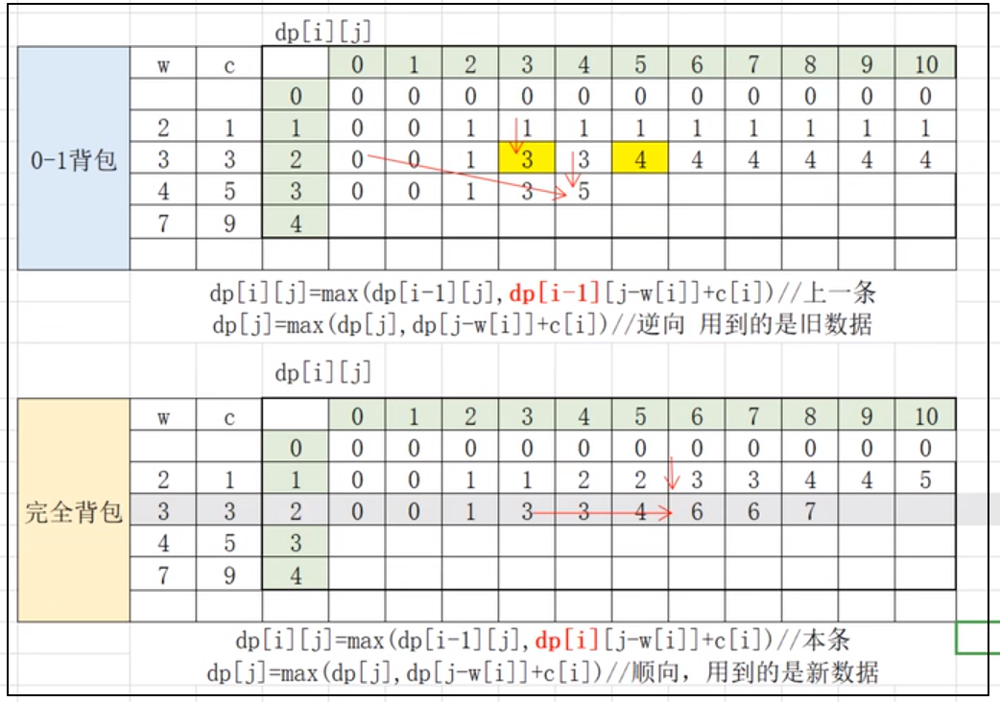
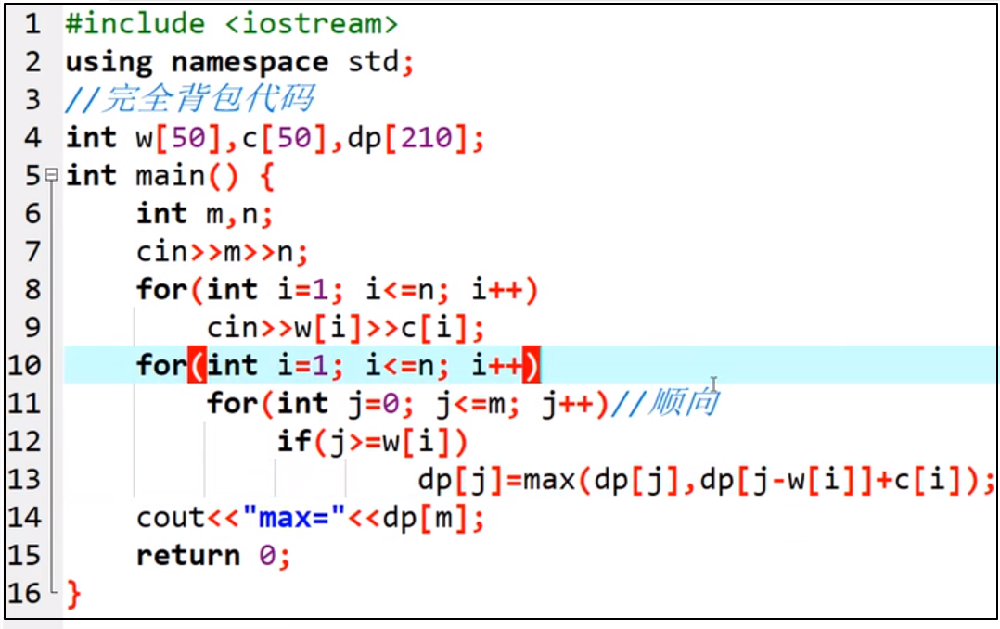
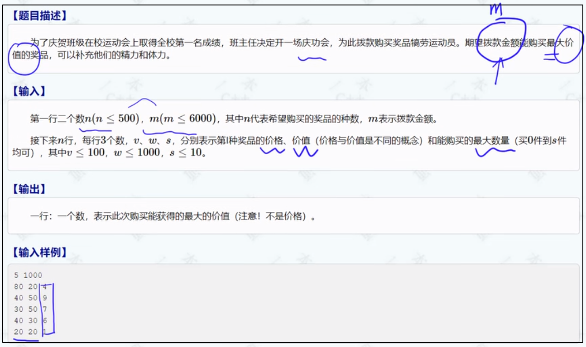
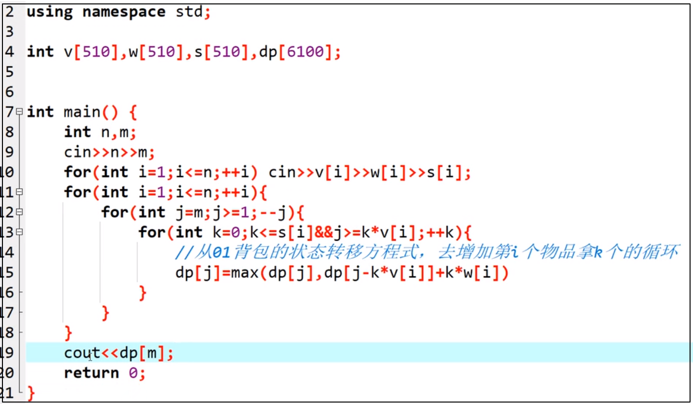

## 一、0-1背包

二维dp

```cpp
#include<iostream>
#include<vector>

#include<algorithm>
using namespace std;

int main()
{
	int target = 10, n = 4;
	vector<int> weight{ 0,2,3,4,7 };//第1个0为无效的，从下标1开始为有效数据，是因为会用到i-1
	vector<int> value{ 0,1,3,5,9 };//第1个0为无效的
	vector<vector<int>> dp(n + 1, vector<int>(target + 1, 0));

	for (int i = 1; i <= n; i++)
	{
		for (int j = 1; j <= target; j++)
		{
			if (j >= weight[i])
				dp[i][j] = max(dp[i - 1][j], value[i] + dp[i - 1][j - weight[i]]);
			else
				dp[i][j] = dp[i - 1][j];
		}
	}
	cout << dp[n][target];
	return 0;
}
```


二维降一维

```cpp
#include<iostream>
#include<vector>

#include<algorithm>
using namespace std;

int main()
{
	int target = 10, n = 4;
	vector<int> weight{ 0,2,3,4,7 };//第1个0为无效的，从下标1开始为有效数据，是因为会用到i-1
	vector<int> value{ 0,1,3,5,9 };//第1个0为无效的
	vector<int> dp(target + 1,0);

	for (int i = 1; i <= n; i++)
	{
		for (int j = target; j >=1; j--)
		{
			if (j >= weight[i])
				dp[j] = max(dp[j], value[i] + dp[j - weight[i]]);
		}
	}
	cout << dp[target];
	return 0;
}
```

### 二、完全背包



#### 2.1朴素方法








#### 2.2一维dp




### 三、多重背包





